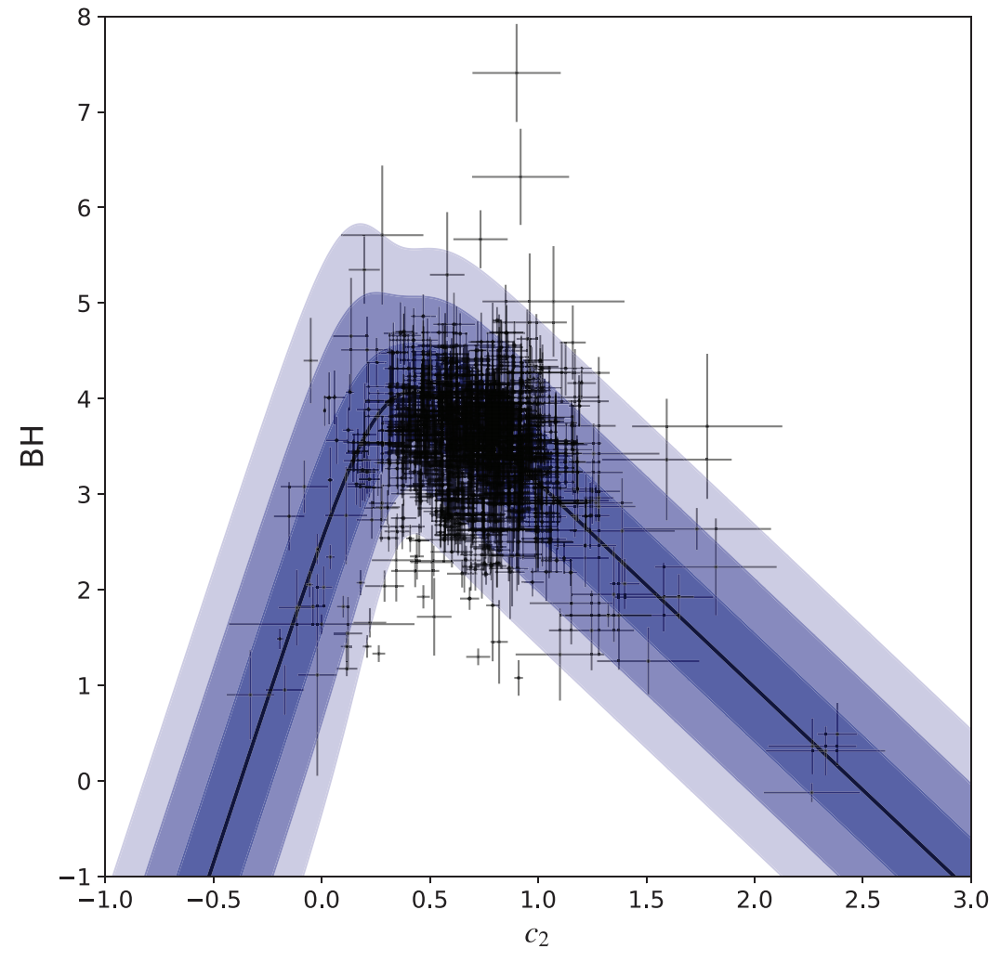
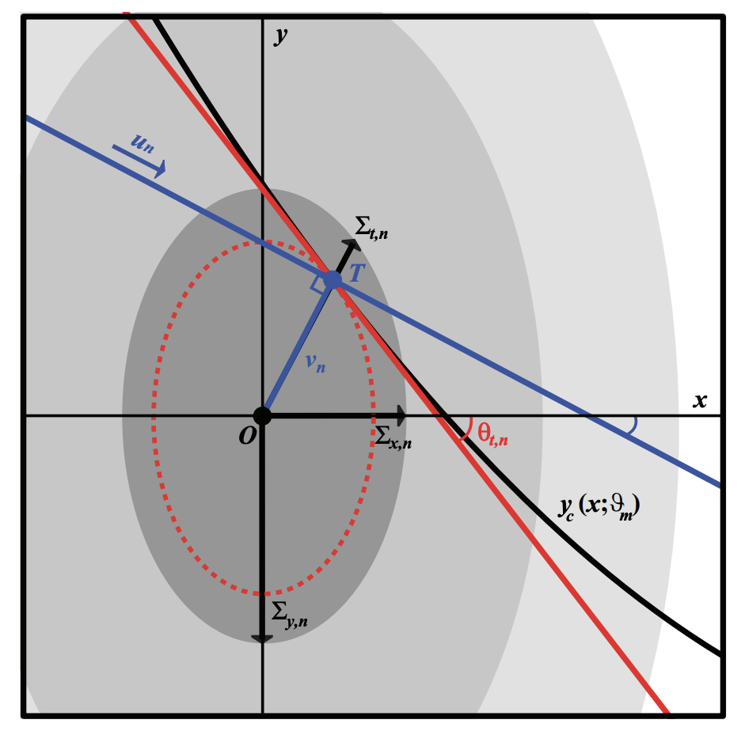

*Example "broken-linear" model distribution fit to interstellar extinction model parameter data (see Konz 2020, in preparation) using the TRK statistic. Shaded regions indicate the 1&sigma;, 2&sigma; and 3&sigma; confidence regions of the model distribution.*

# What is the TRK Statistic?
Robustly fitting a statistical model to data is a task ubiquitous to practically all data-driven fields, but the more nonlinear, uncertain and/or scattered the dataset is, the more diffcult this task becomes. In the common case of two dimensional models (i.e. one independent variable *x* and one dependent variable *y(x)*), datasets with intrinsic uncertainties, or error bars, along both *x* and *y* prove diffcult to fit to in general, and if the dataset has some extrinsic uncertainty/scatter (i.e., sample variance) that cannot be accounted for solely by the error bars, the difficulty increases still.

Here, we introduce a novel statistic (the Trotter, Reichart, Konz statistic, or TRK) developed that is advantageous towards model-fitting in this "worst-case data" scenario, especially when compared to other methods.

*Illustration of the basic geometry of the TRK statistic given a single
datapoint and model curve/distribution, from [Trotter 2011](https://cdr.lib.unc.edu/concern/dissertations/1544bq461). The datapoint is centered at (xn; yn) (point O), with error
ellipse described by the widths (&Sigma;x,n,&Sigma;y,n) that combines the intrinsic 2D uncertainty of the datapoint with the extrinsic 2D uncertainty of the model/dataset in general. The model curve yc(x; &theta;) is tangent to the error ellipse at tangent point (xt,n, yt,n) (point T), and the red line is the linear approximation of the model curve. The blue line indicates the rotated coordinate axis un for the TRK statistic (see Konz 2020, in this repo).)*

# How to Use the TRK Statistical Suite
This statistic, originally introduced in [Trotter 2011](https://cdr.lib.unc.edu/concern/dissertations/1544bq461) is now implemented as a suite of fitting algorithms in C++ that comes equipped with many capabilities, including: 
**1.** Support for any nonlinear model; 
**2.** Probability distribution generation, correlation removal and custom priors for model parameters; 
**3.** asymmetric 2D uncertainties in the data and/or model, and more.

We also have built a web-based fitting calculator ([here](https://skynet.unc.edu/rcr/calculator/trk))through which the algorithm can be used easily, but generally, with a high degree of customizability.

The most recent/current documentation and rigorous/thorough introduction of the statistic/the TRK suite is given in Konz 2020, (in this repo), in preparation. A separate, standalone documentation for the source code itself is also given in the `documentation` folder.

*Probability distributions of model and extrinsic variance parameters describing the example "broken-linear" model fit shown in the first figure, generated using Markov Chain-Monte Carlo methods and the TRK statistic. Distributions of individual parameters are along outside columns, while 2D joint distributions are given as confidence ellipses along the center column, with 1&sigma;, 2&sigma; and 3&sigma; confidence regions.*

# Licensing and Citation
The TRK suite is free to use for academic and non-commercial applications (see license in this repository). We only ask that you cite *Trotter, Reichart and Konz 2020, in preparation*.

For commercial applications, or consultation, feel free to contact us.

Nick Konz, Dan Reichart, Adam Trotter

Department of Physics and Astronomy

University of North Carolina at Chapel Hill
